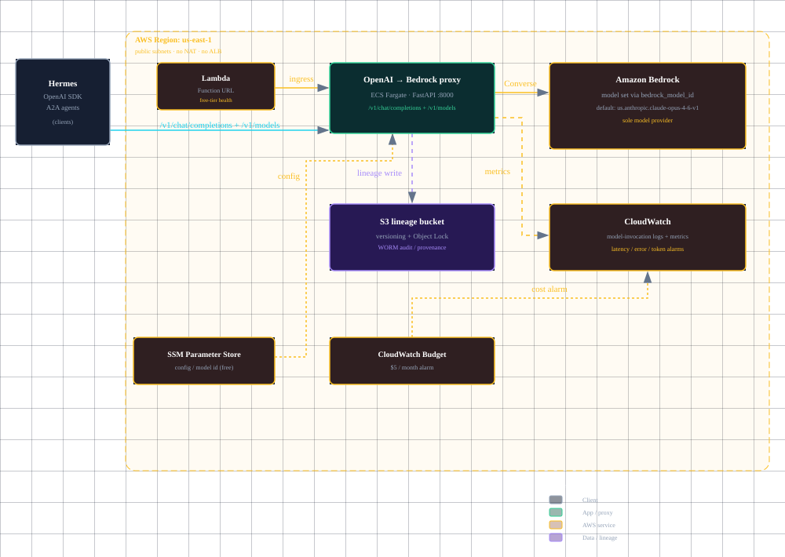

# aws-bedrock-hermes-poc — Bedrock-only ML platform

A working **Amazon-Bedrock-only ML platform** on AWS: one OpenAI-compatible `/v1` contract,
Amazon Bedrock as the *sole* model provider, and the dull, recoverable systems around it —
lineage, observability, governance.

The point of the repo is the invariance that makes agentic AI production-safe: the same
`/v1` shape spans the whole path, so a client plugs straight into Bedrock and never changes
when the model does.

## The architecture

<p align="center">
  
</p>

```
CLIENTS (Hermes / any OpenAI SDK / A2A agents)
      │  HTTP  /v1/chat/completions + /v1/models
      ▼
 Amazon Bedrock  (sole model provider — Claude / Nova / GPT-5.x / Llama / Mistral / DeepSeek-V3.2)
      │  Converse API; model set via bedrock_model_id
      ▼
 feature store, model registry + lineage, monitoring (drift vs breakage vs decay)
```

Everything runs on AWS. **No local model server** — Bedrock is the provider, full stop.

Platform infra (IaC in `infra/terraform/free-tier/`): VPC (public subnets, no NAT) + S3
Object-Lock lineage bucket + ECS Fargate `/v1` proxy + Lambda Function URL ingress +
SSM Parameter Store + CloudWatch + a $5 budget alarm. The enterprise escalation (API Gateway,
EKS, Secrets Manager, CloudTrail, NAT / private subnets) is spelled out as commented reference
in `infra/terraform/enterprise-reference.tf` and as a diagram in
`docs/aws-bedrock-hermes-poc-architecture.html`.

## Why Bedrock, not a self-hosted GPU

Frontier open models are huge — e.g. DeepSeek-V4-Flash is ~284B total / 13B active MoE with a
~103GB+ memory floor. AWS free tier has **no GPU**, and GPU hosts for that class of model run
**$8–25k/mo**. Bedrock is per-token from the first call (tens of dollars per month at
agent-workload volume) and needs zero GPU. The lazy-correct call for daily agent work is the
Bedrock API; self-host only as a short demo.

## Quickstart

### 1. Deploy the free-tier stack

Terraform 1.15.x. Requires live AWS credentials (never commit them).

```bash
cd infra/terraform/free-tier
terraform init
terraform plan
terraform apply
```

Key variables (override with `-var` or a `terraform.tfvars`):

| Variable | Default | Notes |
|----------|---------|-------|
| `region` | `us-east-1` | AWS region |
| `project` | `ml-accent` | Resource name prefix |
| `bedrock_model_id` | `us.anthropic.claude-opus-4-6-v1` | Bedrock model to invoke. Claude needs the cross-region inference-profile ID (bare aliases like `anthropic.claude-opus-4-6` are not on-demand invocable) *and* the Anthropic use-case details form submitted. NVIDIA Nemotron runs on-demand with the bare ID. |
| `notify_email` | — | Email for the $5 budget alarm |
| `ingress_cidr` | — | CIDR allowed to reach the `/v1` proxy |

### 2. Invoke the model

The proxy exposes the OpenAI-compatible contract:

```bash
curl -sS http://<proxy-ip>:8000/v1/models
curl -sS http://<proxy-ip>:8000/v1/chat/completions \
  -H "Content-Type: application/json" \
  -d '{"model":"us.anthropic.claude-opus-4-6-v1","messages":[{"role":"user","content":"Hi"}]}'
```

The task public IP is the ECS task's public DNS/IP and **changes on every redeploy**.

## What's implemented

- **IaC free-tier module** — VPC, S3 (versioning + Object Lock), ECS Fargate `/v1` proxy,
  Lambda Function URL, SSM Parameter Store, CloudWatch log group + metrics, $5 budget and
  bedrock-latency alarm, least-privilege runtime roles.
- **Enterprise reference** — commented `enterprise-reference.tf` (API Gateway, EKS, Secrets
  Manager, CloudTrail, NAT/private subnets).
- **The `/v1` proxy** — `infra/container/app.py`. Translates `/v1/chat/completions` +
  `/v1/models` to the Bedrock Converse API, emits per-request lineage to S3 and invocation
  logs/metrics to CloudWatch. Prompt caching via `cachePoint` on the system block (Claude-only,
  gated to system >= 8000 chars).
- **Lineage** — per-request shadow write to the S3 Object-Lock bucket (WORM audit/provenance).
- **Observability** — CloudWatch model-invocation logs + `InvocationLatency`/error/token
  metrics, plus the budget alarm.

## Roadmap

- [ ] Model registry / lineage + governance audit (regulatory angle).
- [ ] Monitoring split: data **drift** vs pipeline **breakage** vs performance **decay**;
      slow-label handling.
- [ ] Agentic serving: orchestration, retrieval, caching, cost + latency control; A2A route.

## Clients → the API

- **Hermes:** native Bedrock provider — main **and** auxiliary routes (compression / vision /
  summarizer) work on Bedrock. Use **IAM access keys** (Bearer-Token auth is not supported for
  the auxiliary route). Config: `model.provider: bedrock`, `bedrock.region: us-east-1`.
- **curl / any OpenAI SDK:** point at `/v1/*` on the deployed ingress; same contract.
- **A2A agents:** Hermes and Bedrock AgentCore both speak A2A for the agent-card layer.

## Secrets

AWS credentials belong in a secret store (e.g. `envchain`), **never in the repo or memory**.
The runtime IAM roles in the IaC are the real least-privilege boundary.

## License

MIT — see [LICENSE](LICENSE). See [CONTRIBUTING](CONTRIBUTING.md).
